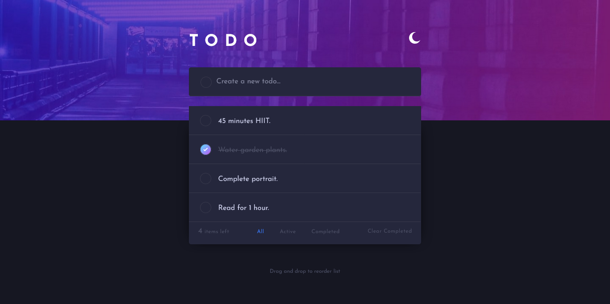

# Todo App
A classic To Do app to list your daily tasks.

### The challenge

Users should be able to:

- View the optimal layout for the app depending on their device's screen size
- See hover states for all interactive elements on the page
- Add new todos to the list
- Mark todos as complete
- Delete todos from the list
- Filter by all/active/complete todos
- Clear all completed todos
- Toggle light and dark mode
- **Bonus**: Drag and drop to reorder items on the list

### Screenshot



### Links

- Solution URL: [Add solution URL here](https://your-solution-url.com)
- Live Site URL: [Todo-App](https://lizzencamelo.github.io/Classic-Todo-App-using-HTML-CSS-JS/)

## My process

    Analyse web app design.
    Build web app.
    Test app.

### Built with

- Semantic HTML5 markup
- CSS custom properties
- Vanilla JavaScript

### What I learned

(i) **prefers-color-scheme:** used to detect if the user has requested a light or dark color theme.
```js
const useDark = window.matchMedia("(prefers-color-scheme: dark)");
```
(ii) **general sibling combinator:** the ~ separates two selectors and matches all iterations of the second element, that follow the first element and are children of the same parent element.
```css
  img ~ p {
  color: lilac;
  }
```

### Useful resources

- [The prefers-color-scheme](https://www.ditdot.hr/en/dark-mode-website-tutorial) - The prefers-colors-scheme using Javascript gets applied depending on the user's color scheme preference in the OS.
- [Drag & Drop](https://baseweb.design/blog/drag-and-drop-list/) - What goes into building a drag and drop component?

## Author | [@lizzencamelo](https://www.frontendmentor.io/profile/lizzencamelo)

